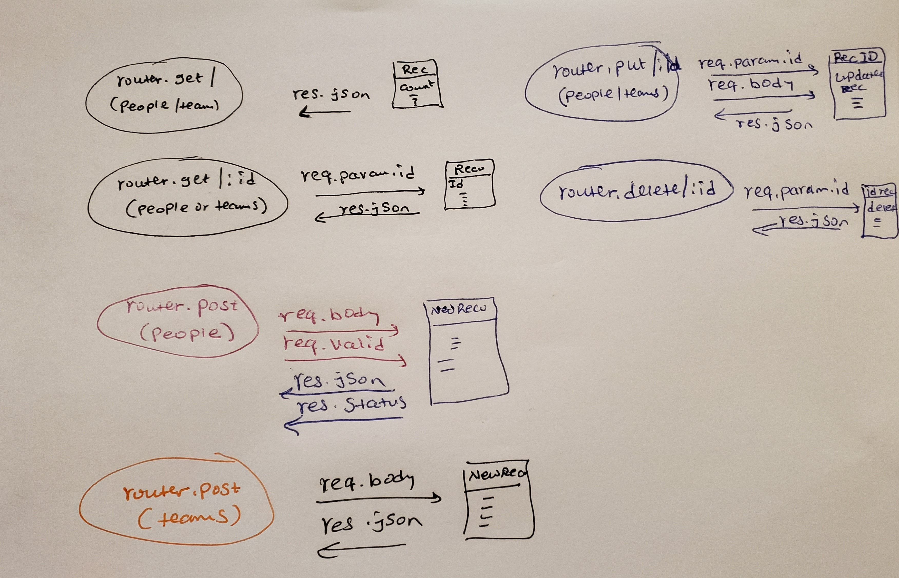

# LAB - 07

## Express
 
### Author: Meron 

### Links and Resources
* [submission PR](https://github.com/meron-401n14/lab-07/pull/1)
* [travis](https://www.travis-ci.com/meron-401n14/lab-07)

#### Documentation
* [api docs](http://xyz.com) (API servers)
* [jsdoc](http://xyz.com) (Server assignments)
* [styleguide](http://xyz.com) (React assignments)

### Modules
#### `people-routes.js`, `teams-routes.js`

#### Running the app
* `npm start`
* Endpoint: `/people` `/teams/`
  * Returns a JSON object with records in it.
#### Tests
* npm test
* What assertions were made? request for end point people, 
* What assertions need to be / should be made?

#### UML
* 

  

